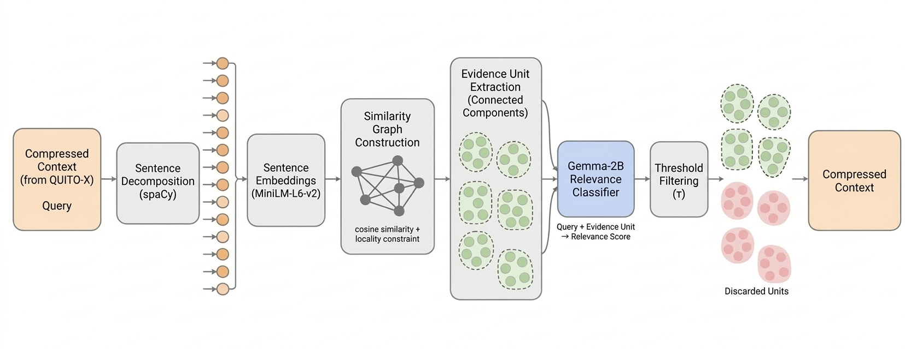

<div align="center">

<h1>GRASP</h1>
<h3>Graph-based Relevance and Attention-driven Span Pruning<br>for Enhanced Retrieval-Augmented Generation</h3>

[](https://www.python.org/)
[](https://pytorch.org/)
[](https://fastapi.tiangolo.com/)
[](LICENSE)
[](<docs/main%20(3).pdf>)

> **Paper under review**
> Amritha Krishna S · Gopika M · Pavan Raj · Nimisha Abraham · Neethu Subash
> Department of Computer Science and Engineering, Mar Athanasius College of Engineering (Autonomous), Kothamangalam, India

</div>

---

## Overview

Standard Retrieval-Augmented Generation (RAG) pipelines forward entire retrieved passages to the reader LLM with little or no filtering. This inflates token budgets, increases inference latency, and introduces distracting noise — especially in multi-hop scenarios where critical evidence is buried under irrelevant text. Existing compression techniques either fragment multi-sentence evidence (extractive methods) or introduce hallucinations (abstractive methods).

**GRASP** addresses this with a **multi-stage, query-aware context compression framework**. It intelligently prunes retrieved content before it reaches the LLM, preserving only semantically cohesive, query-critical evidence _spans_ — not just individual sentences.

---

## Pipeline


The pipeline consists of four sequential stages:

---

## Key Contributions

| Contribution                       | Description                                                                                                                                                                            |
| ---------------------------------- | -------------------------------------------------------------------------------------------------------------------------------------------------------------------------------------- |
| **Hybrid Retriever**               | Fuses dense (Contriever-MSMARCO) and sparse (BM25-Okapi) retrieval via Reciprocal Rank Fusion (RRF, κ=10) to maximise initial recall                                                   |
| **QUITO-X Sentence-Level Filter**  | Adapts QUITO-X from token-level to sentence-level by introducing boundary tracking between tokens and spans, with max-pooled cross-attention scoring from a frozen Flan-T5-Small model |
| **EP-EXIT Evidence Span Grouping** | A GraphSeg-inspired graph-based clustering mechanism that groups semantically related neighbouring sentences into coherent evidence spans before relevance classification              |
| **Span-Level Compression**         | Extends EXIT from sentence-level to span-level classification, allowing the model to evaluate groups of related sentences instead of treating them independently                       |
| **Pareto Frontier Shift**          | Simultaneously improves accuracy*and* reduces latency versus the EXIT baseline on single-hop tasks — pushing the accuracy-efficiency trade-off frontier                                |

---

## Architecture

### QUITO-X: Coarse Filter


QUITO-X adapts the Information Bottleneck (IB) framework to sentence-level filtering using the cross-attention mechanism of a frozen **Flan-T5-Small** (80M parameters):

1. Tokenise all sentences into a flat token array, tracking sentence boundaries `[start_j, end_j)`
2. Chunk into windows of ≤ 510 − |query tokens| tokens; prepend chunk, append query + EOS
3. Forward through Flan-T5 with `output_attentions=True`; extract last-layer decoder cross-attention
4. Apply Gaussian smoothing (σ=2.0) across the token attention array for stability
5. Compute per-sentence score as `max(smoothed_attentions[start_j : end_j])`
6. Retain top-k sentences by score using a dynamic threshold: `k = max(k_min, ⌈r × |S_i|⌉)`, where r=0.8

### EP-EXIT: Fine-Grained Span Filter



EP-EXIT extends EXIT with graph-based evidence unit decomposition:

1. **Embed sentences** via `all-MiniLM-L6-v2` (SentenceTransformer)
2. **Build similarity graph**: Add edge _(i, j)_ iff `|i−j| ≤ w` (locality window=2) **and** `cosine_sim(i,j) ≥ δ` (δ=0.45)
3. **Extract Evidence Units**: Each connected component in the graph becomes one evidence span; isolated nodes are singletons
4. **Classify spans**: Pass each span through the EXIT-fine-tuned **Gemma-2B-it** classifier (`doubleyyh/exit-gemma-2b`, 4-bit NF4 quantised). Relevance score:

   ```
   r(u) = P("Yes" | q, d_i, u) / [P("Yes" | q, d_i, u) + P("No" | q, d_i, u)]
   ```

5. **Retain spans** where `r(u) ≥ τ` (τ=0.5); concatenate retained spans in original document order

**Key difference from GraphSeg:** GRASP uses connected components (not maximal cliques) for broader, more robust grouping; a locality window for efficiency; and is optimised for evidence span selection in RAG (not generic text segmentation).

---

## Experimental Results

Evaluated on **three QA benchmarks** (50 queries each) using **Qwen-2.5:3B** as the reader on an **NVIDIA RTX-4000 Ada Edition GPU (20GB VRAM)**.

### Comprehensive Results (Table I)

| Method               | HotpotQA EM | HotpotQA F1 | HotpotQA R-L | HotpotQA Comp | HotpotQA Lat(s) | NQ EM    | NQ F1     | NQ R-L    | NQ Comp   | NQ Lat(s) | TriviaQA EM | TriviaQA F1 | TriviaQA R-L | TriviaQA Comp | TriviaQA Lat(s) |
| -------------------- | ----------- | ----------- | ------------ | ------------- | --------------- | -------- | --------- | --------- | --------- | --------- | ----------- | ----------- | ------------ | ------------- | --------------- |
| NoOp (Uncompressed)  | 48.0        | 54.61       | 53.94        | 0.0%          | 0.41            | 30.0     | 27.54     | 28.16     | 0.0%      | 0.43      | 82.0        | 41.02       | 40.42        | 0.0%          | 0.70            |
| RECOMP-Extr          | 34.0        | 34.81       | 34.53        | 85.0%         | 0.27            | 32.0     | 30.51     | 30.91     | 79.9%     | 0.27      | 60.0        | 60.51       | 59.85        | 79.8%         | 0.31            |
| LLMLingua-2          | 14.0        | 17.96       | 17.36        | 85.9%         | 0.88            | 24.0     | 22.51     | 22.48     | 84.8%     | 0.99      | 50.0        | 51.68       | 53.68        | 85.8%         | 1.27            |
| EXIT                 | 48.0        | 53.14       | 52.40        | 87.3%         | 1.73            | 24.0     | 24.29     | 24.22     | 69.3%     | 1.72      | 66.0        | 65.84       | 66.80        | 81.6%         | 2.91            |
| **GRASP (Proposed)** | **42.0**    | **46.95**   | **46.75**    | **79.5%**     | **1.19**        | **34.0** | **35.85** | **35.11** | **44.8%** | **1.23**  | **70.0**    | **68.21**   | **67.83**    | **64.3%**     | **2.11**        |

> ↑ higher is better for EM, F1, R-L · Comp = compression ratio (% tokens removed vs NoOp) · Lat = end-to-end latency

### Key Findings

**Single-hop tasks (NQ & TriviaQA):**

- GRASP achieves **+10 EM on Natural Questions** (34.0% vs EXIT's 24.0%) — even beating the NoOp upper bound (30.0%)
- GRASP achieves **+4 EM on TriviaQA** (70.0% vs EXIT's 66.0%)
- **27% latency speedup on TriviaQA** (2.11s vs EXIT's 2.91s) and **28% speedup on NQ** (1.23s vs 1.72s) — despite adding an extra compression stage
- The speedup is paradoxical: QUITO-X's lightweight 60M-param filter removes ~20% of irrelevant sentences _before_ the expensive 2B-param Gemma classifier, shrinking its payload significantly

**Multi-hop task (HotpotQA):**

- GRASP scores 42.0% EM vs EXIT's 48.0% — a known trade-off: graph-based span grouping can remove "bridge" sentences needed to chain multi-hop reasoning steps. This is an identified area for future work.

### Case Study


The case study illustrates how GRASP preserves the critical multi-document evidence span needed to correctly answer a HotpotQA multi-hop question, while RECOMP fails to retrieve the necessary cross-document evidence.

---

## Evaluation Metrics

| Metric                 | Definition                                                                            |
| ---------------------- | ------------------------------------------------------------------------------------- |
| **Exact Match (EM)**   | 1 if the normalised predicted answer contains the normalised gold answer, 0 otherwise |
| **Token F1 (F1)**      | Harmonic mean of token-level precision and recall between prediction and gold         |
| **ROUGE-L (R-L)**      | F-measure of the longest common subsequence (LCS) between prediction and gold         |
| **Compression (Comp)** | `(1 − compressed_tokens / original_tokens) × 100%` relative to NoOp                   |
| **Latency (Lat)**      | Total wall-clock time for compression + answer generation per query (seconds)         |

---

## Repository Structure

```
grasp/
├── app.py                          # FastAPI REST backend (lifespan, auto-indexing)
├── requirements.txt                # Python dependencies
├── .env.example                    # Environment variable template
├── run_evals.sh / run_evals.ps1    # Sequential multi-dataset evaluation runner
├── run_preprocess.sh / .ps1        # Dataset preprocessing runner
│
├── assets/                         # README figures (workflow, QUITO-X, EP-EXIT, case study)
│
├── src/
│   ├── rag_pipeline.py             # End-to-end QueryAwareRAG orchestrator
│   │
│   ├── retrieval/
│   │   ├── retriever.py            # Dense-only Contriever retriever
│   │   └── hybrid_retriever.py     # Hybrid RRF retriever (Contriever + BM25)
│   │
│   ├── compression/
│   │   ├── hybrid_compressor.py    # Two-stage HybridCompressor (QUITO-X → EP-EXIT)
│   │   ├── quitox_filter.py        # Stage 2: QUITO-X coarse filter (Flan-T5-Small)
│   │   ├── ep_exit.py              # Stage 3: EP-EXIT fine filter (graph + Gemma-2B)
│   │   ├── exit_baseline.py        # EXIT baseline compressor (Gemma-2B, 4-bit NF4)
│   │   └── baselines/              # Re-implemented baseline compressors
│   │       ├── exit.py             #   EXIT
│   │       ├── compact.py          #   CompAct
│   │       ├── llmlingua2.py       #   LLMLingua-2
│   │       ├── recomp_abst.py      #   RECOMP Abstractive
│   │       ├── refiner.py          #   Refiner
│   │       └── recomp_extr/        #   RECOMP Extractive
│   │
│   ├── generation/
│   │   ├── reader.py               # Ollama-based RAG reader (Llama-3.1:8B)
│   │   └── gemma_reader.py         # Gemma reader variant
│   │
│   ├── eval/
│   │   ├── eval_pipeline.py        # GenerativeEvaluator (compress → read → score)
│   │   ├── metrics.py              # EM, Token F1, ROUGE-L
│   │   ├── adapters.py             # Unified compressor adapter interface
│   │   ├── interfaces.py           # SearchResult dataclass
│   │   ├── eval_hotpotqa.py        # HotpotQA benchmark script
│   │   ├── eval_nq.py              # Natural Questions benchmark script
│   │   ├── eval_tqa.py             # TriviaQA benchmark script
│   │   ├── eval_asqa.py            # ASQA benchmark script
│   │   └── eval_2wiki.py           # 2WikiMultiHopQA benchmark script
│   │
│   ├── budget_predictor/           # (Experimental) Query-difficulty budget predictor
│   └── data/
│       └── demo_loader.py          # Demo dataset loader for the UI
│
├── scripts/
│   ├── analyze_exit.py             # Step-by-step EXIT pipeline observability tool
│   ├── preprocess_hotpotqa.py      # HotpotQA preprocessing (offline retrieval)
│   ├── preprocess_nq.py            # NQ preprocessing
│   ├── preprocess_asqa.py          # ASQA preprocessing
│   ├── preprocess_2wiki.py         # 2WikiMultiHopQA preprocessing
│   └── preprocess_tqa.py           # TriviaQA preprocessing
│
├── data/                           # Pre-processed datasets (gitignored)
│
└── rag-frontend/                   # React + Vite interactive demo UI
```

---

## Installation

### Prerequisites

| Requirement                  | Version | Notes                                         |
| ---------------------------- | ------- | --------------------------------------------- |
| Python                       | ≥ 3.10  |                                               |
| CUDA                         | ≥ 11.8  | Required for Gemma-2B (4-bit NF4) and Flan-T5 |
| GPU VRAM                     | ≥ 8 GB  | NVIDIA RTX 4000 Ada or equivalent             |
| RAM                          | ≥ 16 GB |                                               |
| Disk                         | ≥ 20 GB | For datasets + model checkpoints              |
| [Ollama](https://ollama.ai/) | Latest  | Required for the reader LLM                   |

### Step 1 — Clone & create environment

```bash
git clone https://github.com/Pvnn/grasp-rag.git
cd grasp-rag

python -m venv env
# Windows
env\Scripts\activate
# Linux/macOS
source env/bin/activate
```

### Step 2 — Install PyTorch (CUDA 11.8)

```bash
pip install torch torchvision torchaudio --index-url https://download.pytorch.org/whl/cu118
```

### Step 3 — Install project dependencies

```bash
pip install -r requirements.txt
python -m spacy download en_core_web_sm
```

### Step 4 — Configure environment

```bash
cp .env.example .env
```

Edit `.env`:

```env
HF_TOKEN=hf_xxxxxxxxxxxxxxxxxxxx     # Required: Hugging Face token (Gemma-2B access)
```

> **Gemma-2B access:** Accept the [Gemma model licence](https://huggingface.co/google/gemma-2b-it) on Hugging Face before the first run.

### Step 5 — Pull the reader model via Ollama

```bash
# Install Ollama from https://ollama.ai/
ollama pull llama3.1:8b
```

---

## Quick Start

### Running the API Server

```bash
python app.py
```

The FastAPI server starts at `http://127.0.0.1:8000`. On startup it initialises the full GRASP pipeline and loads demo datasets. API docs at `http://127.0.0.1:8000/docs`.

### Running the Interactive UI

```bash
cd rag-frontend
npm install
npm run dev
```

Served at `http://localhost:5173`. The UI provides:

- Dataset and query selection with auto-indexing
- Per-sentence QUITO-X attention score visualisation (retained / pruned)
- EP-EXIT evidence unit grouping (kept / removed spans)
- Side-by-side compressed vs. uncompressed answer comparison
- Live pipeline metrics (compression ratio, token savings, latency)

### Programmatic Usage

```python
from dotenv import load_dotenv
import os
from src.rag_pipeline import QueryAwareRAG

load_dotenv()
pipeline = QueryAwareRAG(token=os.getenv("HF_TOKEN"))

# Index your documents (list of dicts with 'title' and 'text' keys)
pipeline.retriever.index_documents(my_documents)

result = pipeline.run(
    query="What instruments on the James Webb Space Telescope are used for observation?",
    top_k=5,
    compare_original=True,   # Runs uncompressed baseline in parallel for comparison
    use_coarse=True,          # Enable QUITO-X stage
    use_fine=True             # Enable EP-EXIT stage
)

print(result['answer'])
print(f"Compression ratio: {result['metrics']['compression']['ratio_chars']:.1f}%")
print(f"Time saved:        {result['metrics']['times']['net_time_saved']:.2f}s")
```

### REST API Reference

| Endpoint        | Method | Description                                      |
| --------------- | ------ | ------------------------------------------------ |
| `/datasets`     | `GET`  | List available demo datasets and queries         |
| `/dataset/load` | `POST` | Manually load a dataset into the retrieval index |
| `/query`        | `POST` | Execute the full GRASP pipeline on a query       |

**`POST /query` payload:**

```json
{
  "query": "Were Scott Derrickson and Ed Wood of the same nationality?",
  "top_k": 4,
  "compare_original": true,
  "use_coarse": true,
  "use_fine": true
}
```

---

## Dataset Preparation & Evaluation

### 1. Preprocess Datasets

```bash
# Windows
.\run_preprocess.ps1

# Linux/macOS
bash run_preprocess.sh
```

Preprocesses all benchmarks with offline top-30 hybrid retrieval into `data/<dataset>/`. To run a single dataset:

```bash
python scripts/preprocess_hotpotqa.py
```

### 2. Run Evaluations

```bash
# All datasets, 50 samples each
# Windows
.\run_evals.ps1 -N 50

# Linux/macOS
bash run_evals.sh 50

# Single dataset
python -m src.eval.eval_hotpotqa -n 50
python -m src.eval.eval_nq -n 50
python -m src.eval.eval_tqa -n 50
```

Results are saved to `src/eval_results/<dataset>/`:

- `final_benchmark_results.csv` — aggregate metrics for all compressors
- `details_<compressor>.csv` — per-query traces with context, predictions, and scores

---

## Configuration

| Parameter                  | Default | Description                                         |
| -------------------------- | ------- | --------------------------------------------------- |
| `top_k`                    | 5       | Documents to retrieve                               |
| `coarse_ratio` (r)         | 0.8     | Fraction of sentences retained after QUITO-X        |
| `quitox_min_keep`          | 2       | Minimum sentences kept per document                 |
| `fine_threshold` (τ)       | 0.5     | EP-EXIT inclusion threshold                         |
| `similarity_threshold` (δ) | 0.45    | Cosine similarity edge threshold for evidence graph |
| `locality_window` (w)      | 2       | Maximum sentence index distance for graph edge      |
| `rrf_k` (κ)                | 10      | RRF smoothing constant                              |
| `gaussian_sigma` (σ)       | 2.0     | Smoothing for QUITO-X attention scores              |

### Ablation Setup

Each stage can be toggled independently:

```python
# QUITO-X only
result = pipeline.run(query, use_coarse=True, use_fine=False)

# EP-EXIT only
result = pipeline.run(query, use_coarse=False, use_fine=True)

# Full GRASP pipeline
result = pipeline.run(query, use_coarse=True, use_fine=True)

# No compression (NoOp baseline)
result = pipeline.run(query, use_coarse=False, use_fine=False)
```

---

## Models

| Component          | Model                         | Parameters | Quantisation |
| ------------------ | ----------------------------- | ---------- | ------------ |
| Dense Retriever    | `facebook/contriever-msmarco` | 110M       | FP32/FP16    |
| QUITO-X Filter     | `google/flan-t5-small`        | 80M        | FP16         |
| Sentence Embedder  | `all-MiniLM-L6-v2`            | 22M        | FP16 (GPU)   |
| EP-EXIT Classifier | `doubleyyh/exit-gemma-2b`     | 2B         | 4-bit NF4    |
| Reader LLM         | `llama3.1:8b` (Ollama)        | 8B         | Q4_K_M       |

---

## Limitations & Future Work

- **Multi-hop reasoning:** The graph-based span grouping can remove "bridge" sentences needed to connect multi-hop reasoning chains. Future work targets hop-aware weighting in the evidence graph.
- **Fixed compression ratio:** QUITO-X uses a static `coarse_ratio`. A query-difficulty-aware budget predictor (see `src/budget_predictor/`) is under development.
- **English only:** Current models are English-specific. Multilingual dense retrievers and sentence encoders are a direct extension path.
- **End-to-end training:** Compression and reader are currently independent; joint training is planned.
- **Scope:** Text-based English-language QA only. Abstractive summarisation, multi-modal retrieval, and cross-lingual RAG are out of scope.

---

## Project Context

> **Department of Computer Science and Engineering**
> Mar Athanasius College of Engineering (Autonomous), Kothamangalam
> APJ Abdul Kalam Technological University · May 2026

**Project Guide:** Prof. Neethu Subash · **Coordinator:** Prof. Nimisha Abraham

---

<div align="center">
<sub>Built with ❤️ at Mar Athanasius College of Engineering · Department of Computer Science and Engineering</sub>
</div>
